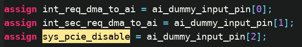
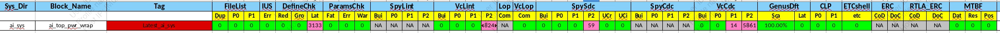
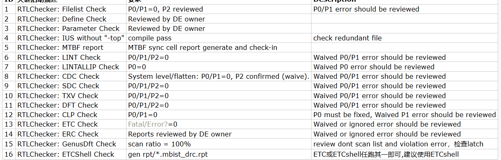
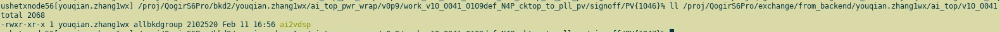
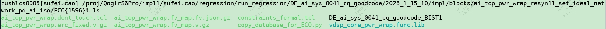
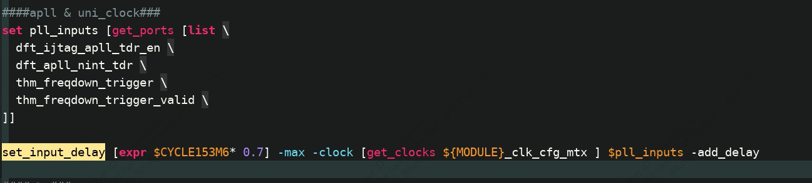

## 2025-11-20

- [ ] aging sensor时序修改
- [x] ai2pcie mtx需要修改outstanding
  - [x] 已告知songlin，确认不需要修改

- [x] dvfs反压加入cfg_clk cgm en
  - [ ] 

- [x] uniclk 默认值修改
- [x] ist bist mode需要将BistEn=Y的时钟在ist_bist模式下开启
  - [x] clk glue里的ist bist连接上

- [ ] STC补充，增加ai2pcie axi2axi和mem_fw apb2apb
- [ ] vdsp梳理
  - [ ] vdsp port梳理
  - [ ] vdsp clk arch

## 2025-11-28

- [x] 报销
  - [x] 部门
  - [x] 羽毛球

## 2025-12-05

- [x] ram把bit enable下成0
  - [x] 已无法修改，因为ip已经0.9

- [ ] ai_scc_ro的set output delay去掉

## 2025-12-10

- [ ] pr guide补全

## 2025年12月16日

- [x] ptest_scan_reset_n
- [x] vau r1p3 09 002进版

## 2025年12月19日

- [ ] sdc
- [x] ai2pcie加regslice
  - [ ] downstream disable未连
  - [ ] 

- [ ] pcie的两个中断，由dummy接入
  - [ ] 没有加mask逻辑

- [ ] debug bus更新

## 2025-12-22

- [x] dslp逻辑缺少缺main_m4的lpc
- [ ] 中断表格改下路径
- [x] 删除vdsp两个rst
- [x] 删除uni_clock_vdsp和uni_clock_vdsp_ctrl，将shift_div2接入vdsp_clk
- [x] slv fw好像还没进版

vdsp: 

	1. 频率信息删掉
	1. v130删掉
	1. vdsp_core_pwr_wrap删掉
	1. 是否是user mannual里有的
	1. firewall相关寄存器删除
	1. 所有寄存器描述都加上

## 2025-12-29

- [x] ai那边的device spec合入
- [x] pr guide更新
- [x] dummy表格更新
- [x] debug bus更新
- [x] 报销

## 2026-01-07

- [x] nic400 clks4异步问题 重新生成 待合入

## 2026-01-08

- [x] low speed逻辑看一眼有没有问题
- [x] dummy port表填一下
- [ ] false path在ai sdc里加一下

## 2026-01-12

- [x] upf——yuanchun
- [x] ckmux——zhilin
- [x] bugzila
- [x] clk plan更新——xuening
- [x] 绩效自评
- [x] 考勤
- [ ] ai的stc好了，你可以拿过去先跑spysdc
- [ ] 
  - [x] vclint P2 18245
  - [x] spysdc P2 59
  - [x] vccdc P1 14/P2 5861
  - [ ] ERC/RTL_ERC
  - [x] MTBF rpt
- [ ] qos在测性能case时需要配成4

​		

## 2026年1月26日

- [ ] 把安全相关int 的mask去掉

## 2026年2月6日

- [ ] ddr_wake_up_n
- [ ] eco网表
- [ ] deadlock检查
- [ ] slv_fw_eb构造case
- [ ] device spec

## 2026-02-25

- [ ] timing 问题 看下是不是要下exception

  - [ ] 	

    

- [ ] ECO

  - [ ] 
  - [ ] 
  - [ ] 需要跑LEC
  - [ ] 需要改UPF

- [ ] deadlock邮件回复

