❤️|💛|💙|💚|
--|--|--|--
高优先级|中优先级|低优先级|/
未完成|未完成|未完成|已完成

## 2025/7/17  

1. 💚 10 tag release邮件
2. 💚 s6p ai arch更新  

## 2025/7/18  

1. 💚 changelist  

## 2025/7/29  

1. 💚 后仿波形确认
   1. 💚 uniclk&clk_core内部没有rst同步模块，需要规范软件对ai sys软复位行为
2. 💚 mem floating——ongoing
   1. 💚 ai_share_mem addr[15] deaddead
3. 💚 确认stc R24-01-02最新check list是否还存在问题
4. 💚 ai clk_glue 修改完毕 
5. 💚 地址回绕问题确认
6. 💚 worklog填写d 
7. 💚 sync_buf_idma中regfile2p_16x289
8. 💚 ocm 1MB计算过程 ddl 8.4
9.  🔵 sync_buf wr/rd问题
10. 🔵 画lowpower/reset arch/clock arch 参考mm sys 
11. 🔵 clk gui & dvfs 了解&try run
12. 💚 加入26m的源以后，为何能保证复位的时候没有时钟
   1. 硬复位：26m clk有sys专用gate，pmu给ai上电复位时，pmu会在ai复位之前gate该时钟，复位释放之后才会释放，ai的配置时钟sel默认在26m，以此保证硬复位过程中不会有时钟
   2. 软复位：无法确保，没有对应gate反压，但S6软件不会使用
13. 💚 77对比21 为何svt增加，lvt减少？
14. 💚 lp stat？mem_fw_eb 改成其他值配一下？

## 2025/7/31

1. 💚 bugzila  
2. 💚 changelist review aciton追踪  

2. 💚 changlist加上还没修改代码的点
3. 💚 让npu ip出一版带ulvt u2p memory的版本

## 2025/8/1

1. 💚 flat cdc  清理

2. 💚 changelist review及action追踪
   1. 💚 matrix的write outstanding是否能够达到要求

## 2025/8/5

1. 💚 ai low power arch更新
2.  💚 ai clock arch绘制

## 2025/8/8

1. 💚 沟通vdsp插slice问题
   1. vau相关的aw/ar通路是否能优化，不插slice
      1. 将vau位置上挪后（加region），vdsp2vau得到改善，但是vau2mtx 违例增加到0.13
         1. mtx2mtx r通道路径，违例达0.33
   2. cfg_s2 -> vdsp suboridinate也存在timing问题,约0.17
      1. 需要将reg_slice配置为打拍
   3. 
2. 💚 dbg bus是否为sys最新版本 
3. 💚 pcie，抓level shifter 延时
4. 💚 ase 跑完数据对比错误

## 2025/8/11

1. 💚 S6P NPU+VDSP加PowerSwitch 实验结果讨论
   1. 预计SYS内增加power switch后，IR可能会恶化1.5%到2.5%，可能需要在额外抬压50mV到0.90V才能改善IR问题
2. 💚 s6 ai后仿rst需要确认timing violation，预计只有clk core内部存在x态

## 2025/8/20

1. 💙 vc里qogirs6pro_define.v ?
2. 💚 和泽峰确认mem_fw连接
3. 💚 和bingwei确认ai_clk_glue.V

## 2025/9/1

2. 💚 AI系统说明书，有两个AISYS的问题修改
3. 💚 ai sys cv对齐会议
4. 💚 截止9.3 PBS ai sys修改
   1. 删除tower
   2. 删除axi top2ai异步桥？
5. 💙 NPU 64K sram优化
   1. before：2个64KB的SRAM
      1. 2048深度，256bit
      2. 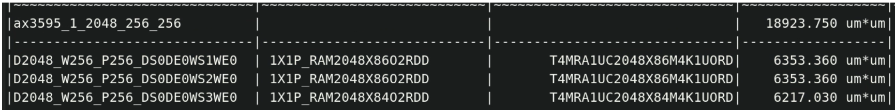  
   2. after：2个32KB的SRAM
      1. 1024深度，256bit
      2.   
   3. conclusion：预计减小0.0159mm2（综合面积）

## 2025/9/2

1. 💛 sta检查时钟周期正确
2. 💛 ai2pcie 通路
   1.  matrix+异步桥w端
   2.  matrix具体细节待确认
   3.  💚 pcie port fix
       1.  async bridge w
       2.  lp_stat_ai2pcie
3. 💚 ai clk glue还是有点问题，div_sel应该怎么选
    1.  改之前  
    2.  改之后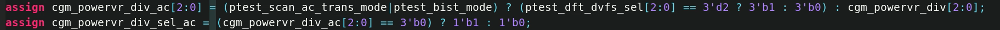  
    3.    

## 2025/9/4

1. 💛 dvfs 更新ipa后对比rtl
2. 💛 pr 更新timing 查看
   1.   

3. 💛 slv fw进版更新
4. 💛 dbg bus修改
5. 💛 dv后仿 vio查看

## 2025/9/5

1. 💚 tower 006进版修改port位宽

## 2025/9/8

1. 💛 ocm slack
   1. 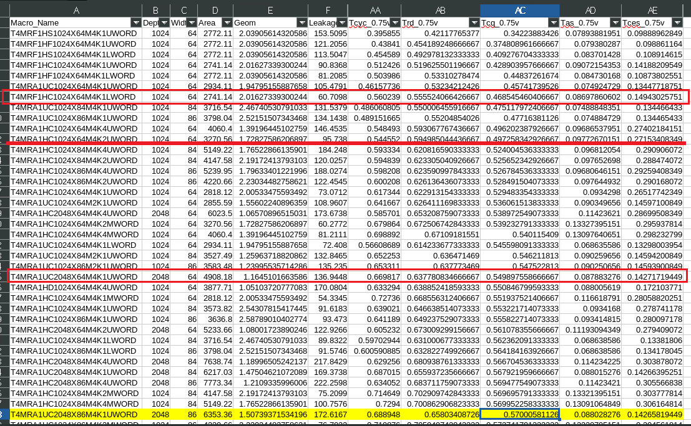  
   2. 现在大是因为multi bit，导致绕线很多
2. 💛 data path是否合理
   1.   
   2.   

## 2025/9/9

1. 💛 clk tree是ulvt ll，瑞奇推荐使用ulvt
2. 💛 后仿波形确认——第二轮回归的结果，vio还是得看，多关注下第一轮重点看的vio
   1.   
   2. 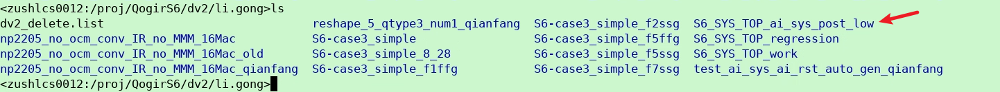   
3. 💙 ai实验室有个偏技术项目的开发, 主要是一个可配置(预计96T)算力ai sys层的开发
   1.   

4. 💛 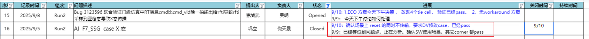  

## 2025/9/11

1. 💛 ai2pcie修改点总结
   1. 加main_mtx_s4的lpc，asb_ai2pcie也用这个
   2. asb_ai2pcie rst 用main_mtx的
   3. mtx axi4, asb axi3
   4. mtx lock 1bit, asb lock 2bit 
   5. 需要多开3个ep的mailbox
2. ❤️ dvfs ipa待合入，需要开3bit port 
3. ❤️ 更新后的slv fw也需合入

## 2025/9/16

1. 💛 s6p ai性能指标
   1.   
2. 后仿复位改安全复位case
   1. vau软复位改成安全复位之后，会force vdsp传输，等到总线idle之后再发起复位，case pass

## 2025/10/13

1. 💙 sdc加入0.85v
2. 💙 mtx & slv fw给vdsp decode

## 2025/10/24

1. 💙 s6建议三档（0以下/常温/高温）
   1. 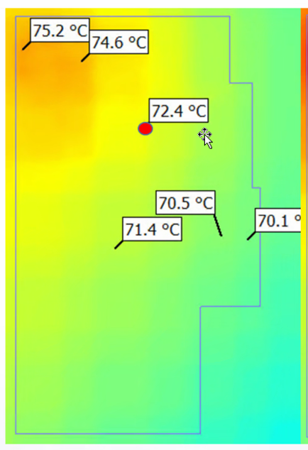  
   2.   
   3. 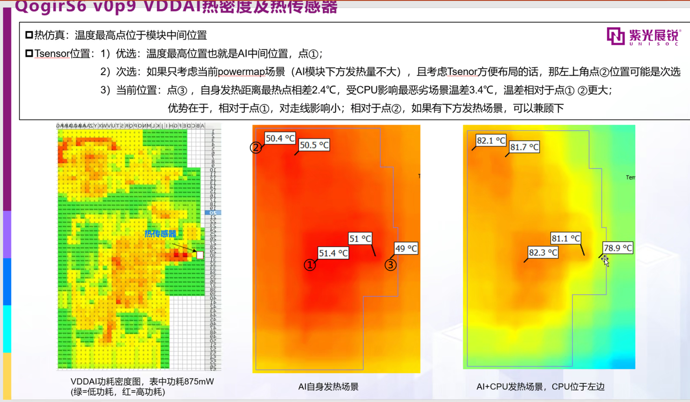 
   4.   
   5.   
   6. 需不需要增加一个thm——待讨论
   7. s6p后续仿真，定thm具体位置

## 2025/10/28

1.    
  1.  erc报出来有clk on data  
  2.  换了clk_mux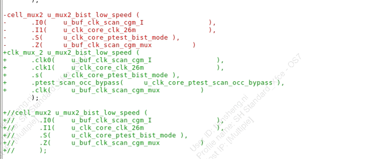  
  3.  但得换ckmux，否则在occ_bypass为1时会切到clk_scan_ate，后者为内部时钟，非外部低速时钟，影响npu/vdsp在低速下的binning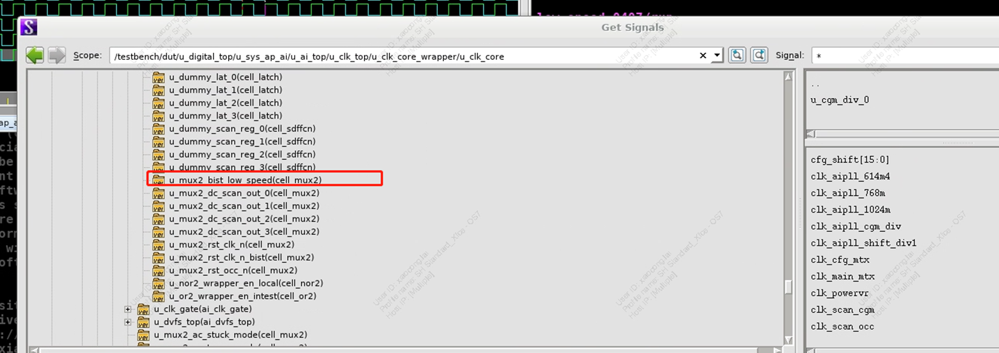  

2.  cbuf memory有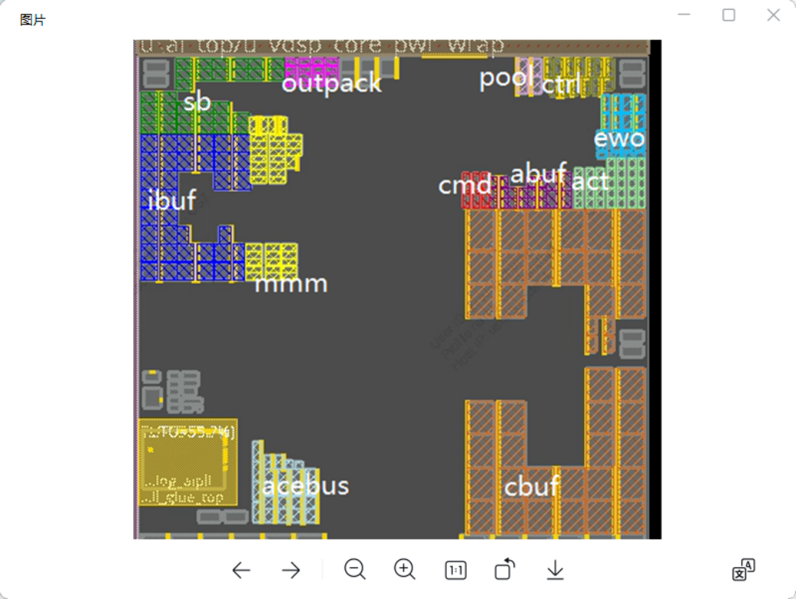  

3. 💙 ase controller PENY晚于SE一派拉低    

4. 💛 hld上传
5. ❤️ fifo wr cmd和data是否能分离
6.  dvfs busy拉到clk cfg mtx
7.  反标featurelist
8.  checklist
9.  changelist
10. 💛 面积变更项准备材料
11. ❤️ uniclk mode默认值改成0
12. async_bridge_w_ai2pcie*-/ 时钟接错
13. dvfs ipa的en修改默认值  

## 2025/11/14

1.  clk plan
  2.    
  3.  需要pull一下top

## 2025-11-21

- [ ] io/mem floating检查
  - [ ] 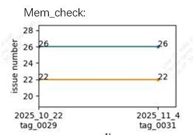

- [ ] io check
  - [ ] 

