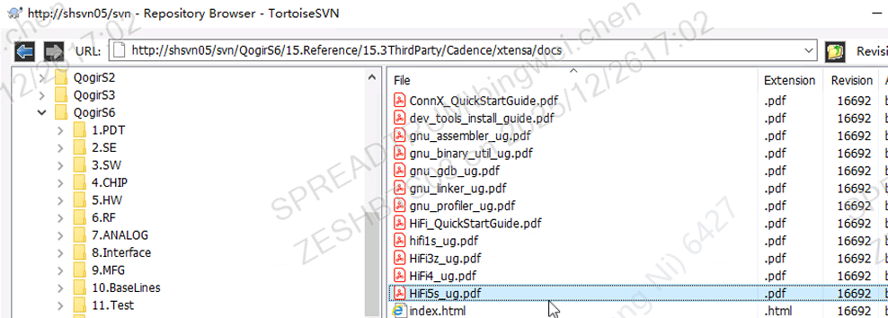

n6p-vq7-nx

s6-v130-lx

s6p-v230-nx

| 项目 | 名称   | 架构 | 算力    | MAC单元  |
| ---- | ------ | ---- | ------- | -------- |
| n6p  | vq7    | nx   | 1TOPs   | 512 8bit |
| s6   | v130   | lx   | 0.5TOPs | 256 8bit |
| s6p  | v230   | nx   | 1TOPs   | 512 8bit |
| s6   | np2205 |      | 4TOPs   | 2048     |

