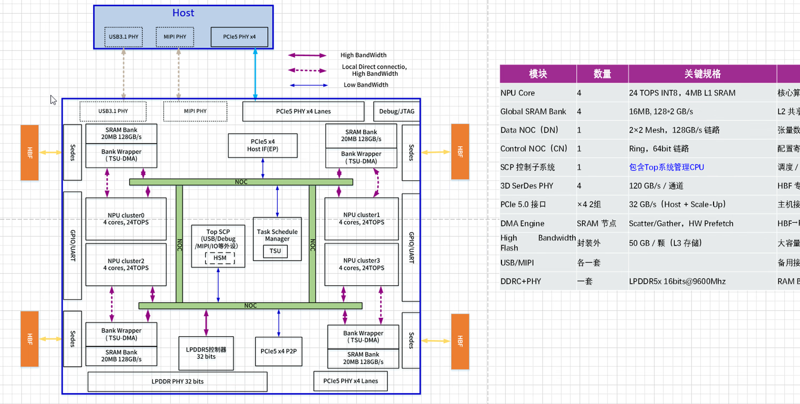
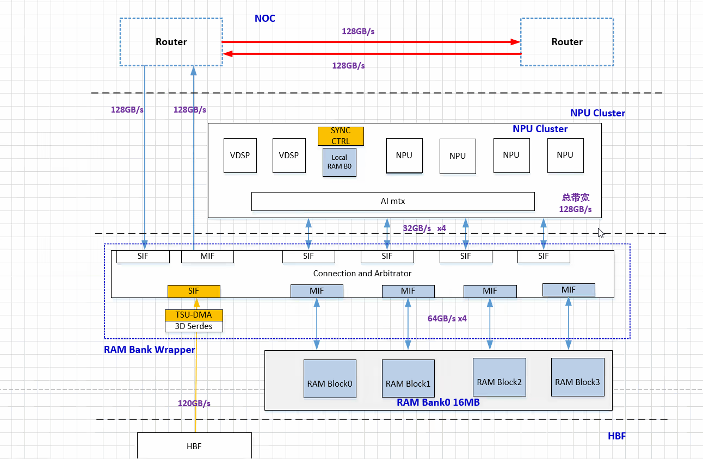
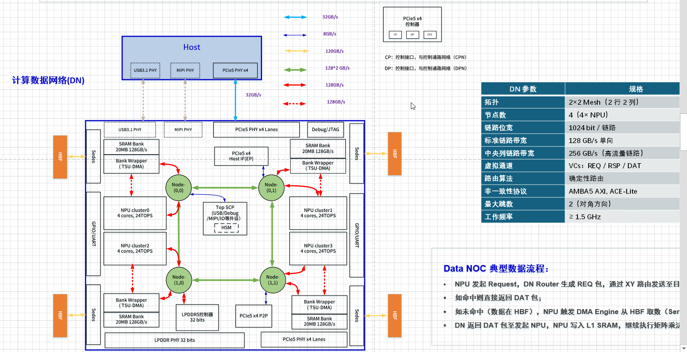
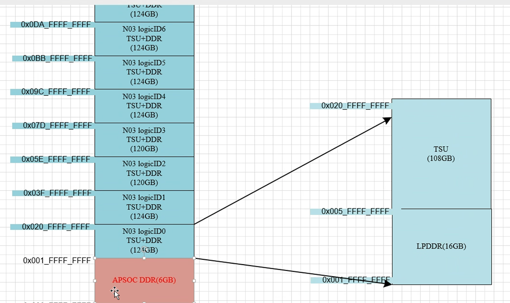
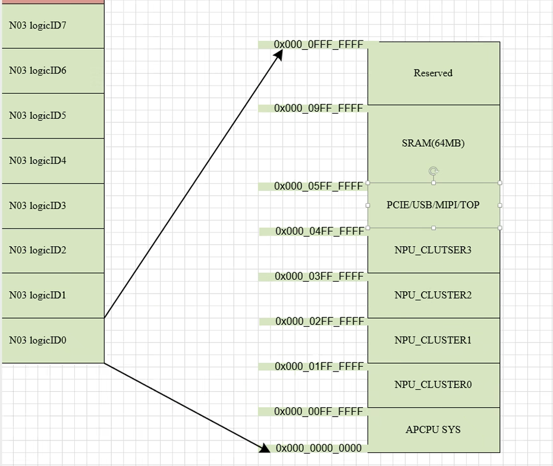
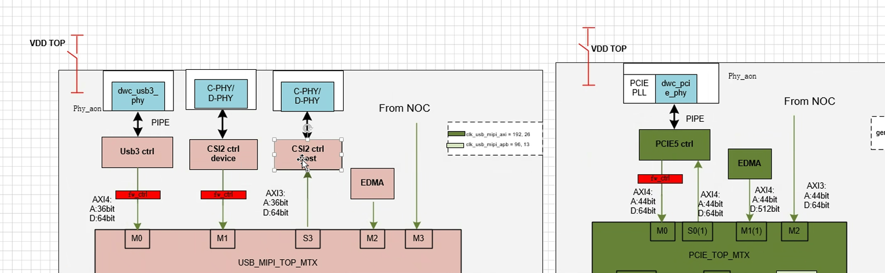
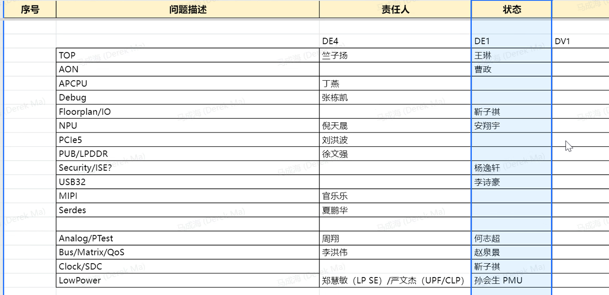
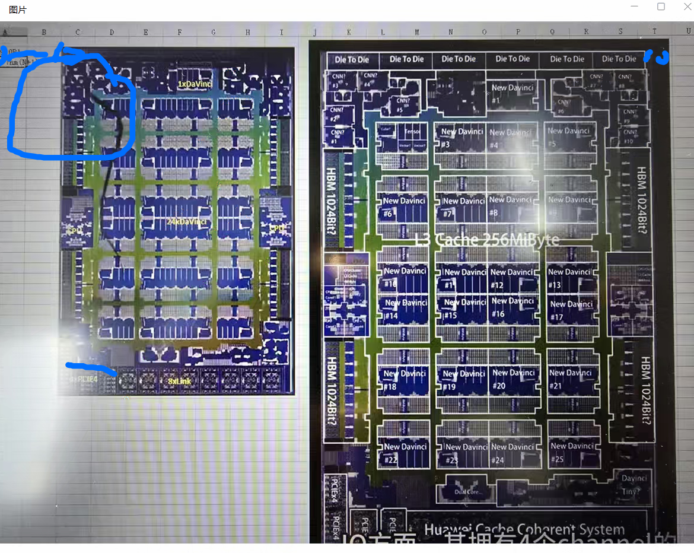

1. SOC架构图
   1. 
   2. HBF: High Bandwidth Flash
      1. 延时2ms
   3. PCIe5x4：
      1. 第一组与host交互
      2. 第二组作多芯互联
   4. TSU：
      1. 接受上游的分配任务，将计算任务分发到NPU cluster，将结果返回到PCIE->Host
   5. USB
      1. 上下游通信
      2. debug
   6. DDR实际为16bit
2. NPU cluster架构
   1. 
3. NOC架构
   1. 
4. 地址分布
   1. 
   2. 
5. 外部通信3选一
   1. usb/csi/pcie
   2. 
6. 项目相关
   1. TO时间：27年1月底
   2. 人员安排
      1. 
7. 华为**昇腾 Ascend** NPU
   1. 

