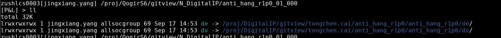
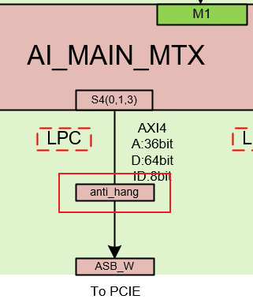
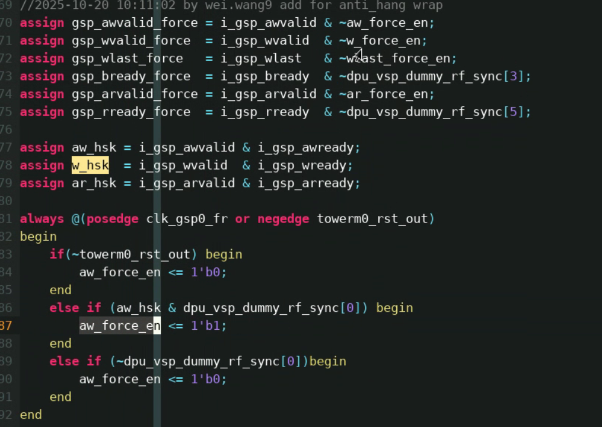
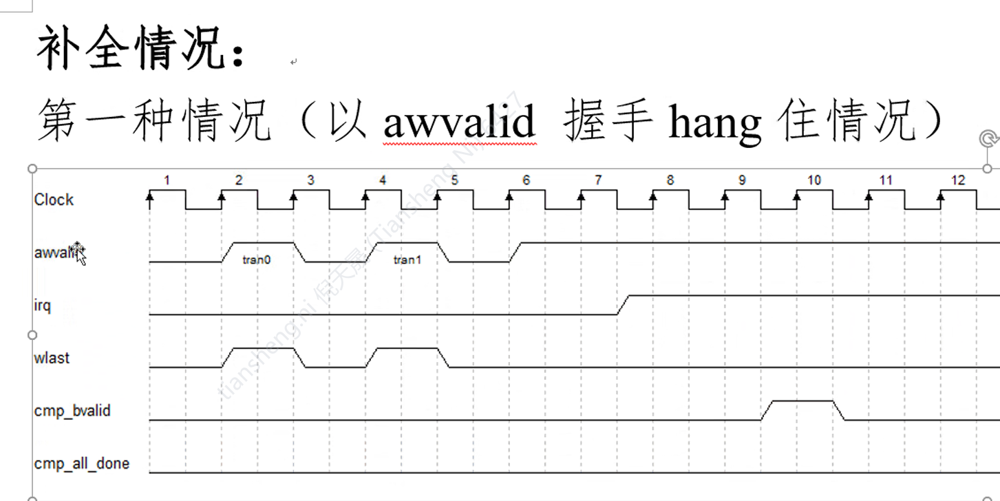
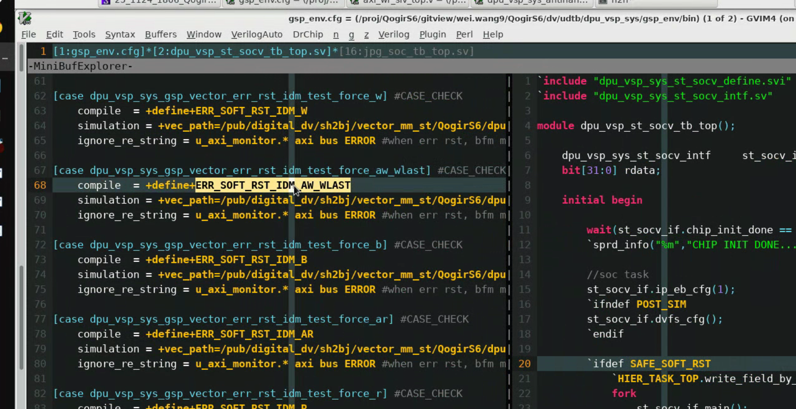
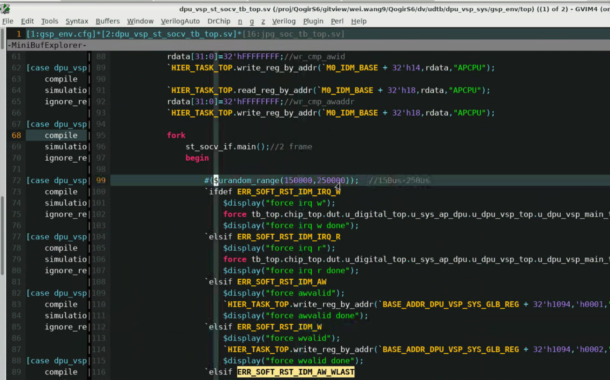
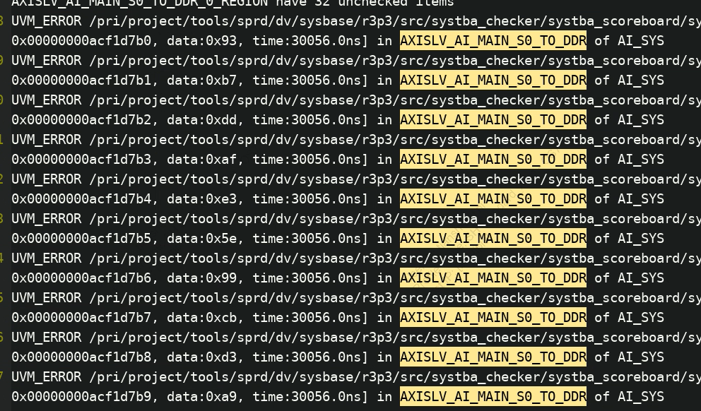
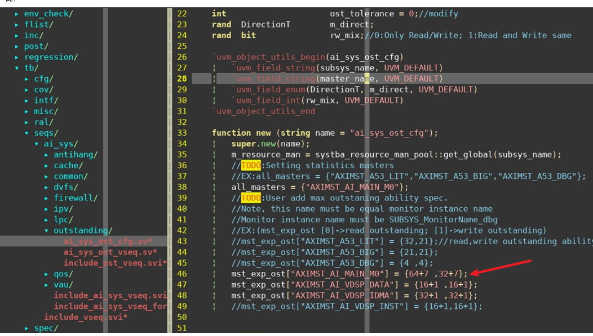
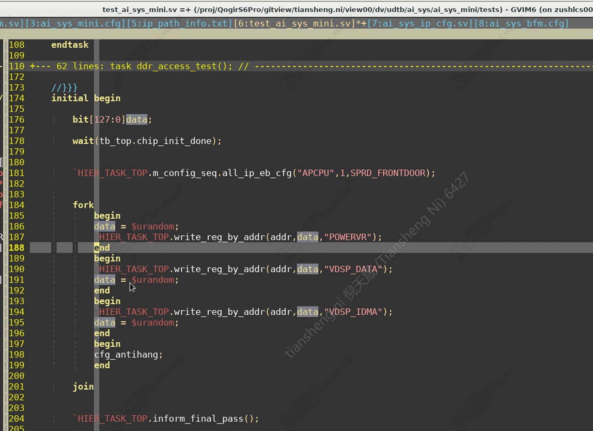
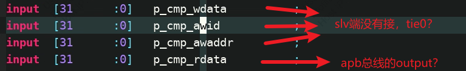

## 修改内容

### RTL修改

> 在RTL0P5基础上新增antihang分支，不改动master代码
>
>  

1. 增加antihang ip，插在matrix_s4和asb_ai2pcie中间
   1.  

2. apb_decode新增antihang，并加入apb2apb异步桥
   1.  
   1. 

3. 通过rf中的dummy output，cdc到antihang ip中，用来& force axi握手信号

   1. 参考dpu:master的机制,valid/last信号需要在hand shake之后再加入随机挂死

   2.  

   3. 
   
      

> 问题：
>
> 	1. clk接freerun
> 	1. time_pulse_in tie0
> 	1. paddr 12bit——4096B——4KB？
> 	1. o_irq_timeout和o_irq_buserr接到dummy_in
> 	1. 接rf的信号：/i_axready/i_rvalid/i_wready/i_rlast/i_bvalid

> 参数：
>
> 1. OUTSTANDING_NUM_W = 32
> 2. OUTSTANDING_NUM_R = 64
> 3. ID_W = 9
> 4. LEN_W = 8
> 5. ADDR_W = 36 ?
> 6. D_W = 64
> 7. WR_EN = 1
> 8. RD_EN = 1
> 9. MST_SLV_FLG = 0

### 环境修改

#### 需求

1. 以bus用例为基础，人为加入随机挂死
2. 触发timeout，环境就不比对，这样不会挂死
3. 触发timeout以后，master还会继续发
4. 补完以后，会回illegal response
5. m0和m1一起发

#### 三种挂死情况

1. awvalid来了，awready为0
   1. 
2. data发了cmd没发
3. data发完 b通道没有反应

#### case修改点

## dpu环境参考

tb

cfg

## ttb环境测试

ttb=

