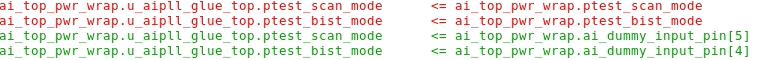
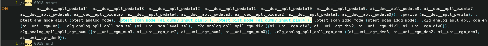
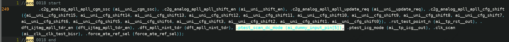
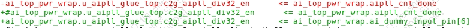
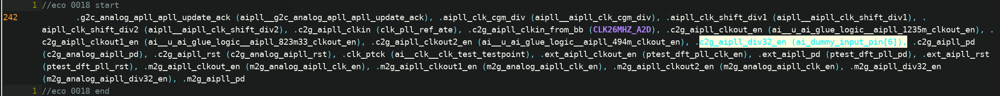
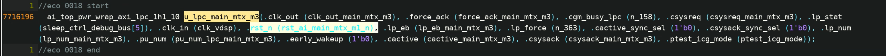
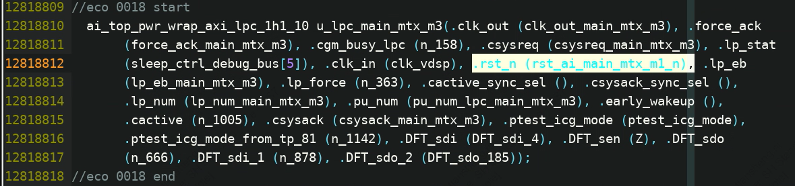
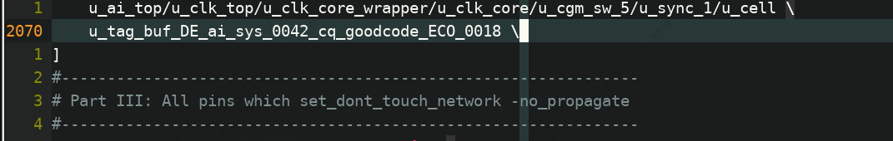
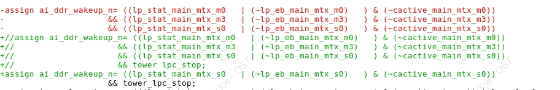
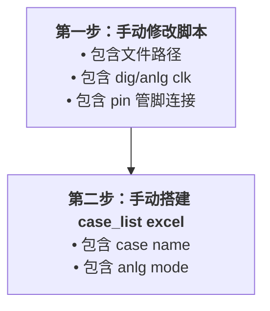

1. aipll——ptest_scan_mode/ptest_bist_mode/aipll_cnt_done
   1. aipll-ptest_scan_mode/ptest_bist_mode
      1. rtl
         1. 
      2. fv
         1. 
      3. erc
         1. 
   2. aipll-ptest_scan_dc_mode
      1. rtl
         1. ​	
      2. fv
         1. 
      3. erc
         1. 
   3. aipll-c2g_aipll_div32_en
      1. rtl
      2. fv
      3. erc
         1. 
2. rst_ai_main_mtx_m3_n<--u_rst_ai_clk_vdsp_n
   1. rtl
   2. fv
   3. erc
3. tag buf
   1. dont_touch.tcl
      1. 

   2. fv

   3. erc
      1. 

4. ai_ddr_wakeup_n（已删除）
   1. 

5. 

