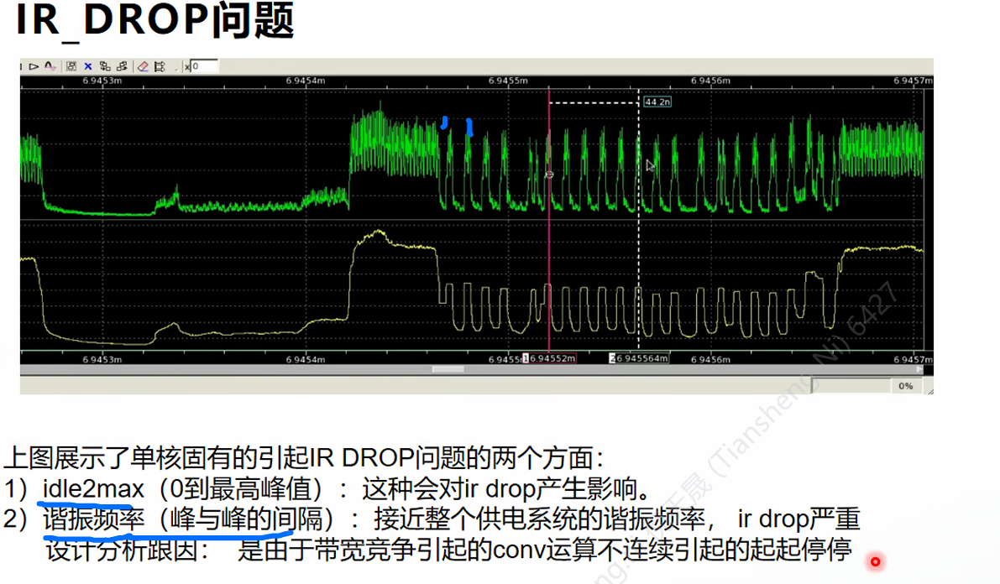

线性加速比

带宽bond

npu和vdsp交互进行

​	目前是交互

峰值是32GB×4

​	LPDDR5是70GB

IR

风险点

1. Memory 2MB*5，且每个core都会访问，timing收敛风险，面积过大PR布局风险
2. IR drop——idle2max在多核设计下会更高，IR问题收敛风险
3. 各AI CORE时钟
   1. 如作同步:timing收敛影响；1/4固定相位差能带来的IR收益有多大
   2. 如作异步：无法固定1/4相位差，IR风险
4. 多核设计下电流倍增带来的电源风险