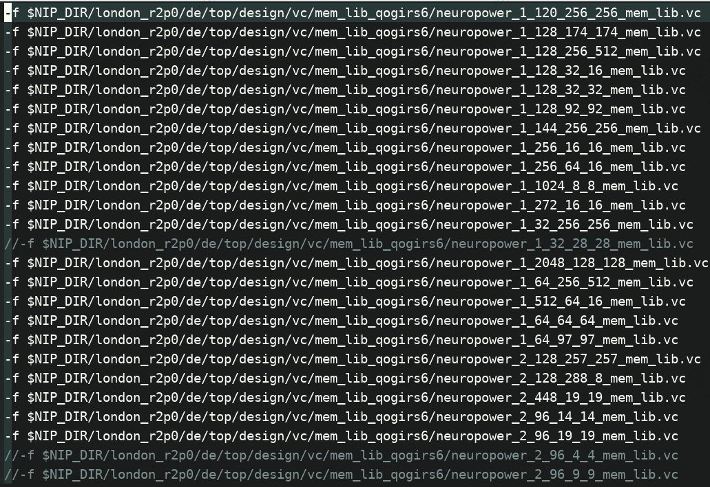

| 项目                           | 算力   | std area  | mem area  | PR area |
| ------------------------------ | ------ | --------- | --------- | ------- |
| S6P（0019）                    | 10T    | 359856.15 | 380566.25 | 1.1674  |
| S6  （RAM1×8，RAM2×16）        | 4T     | 273400.44 | 235092.19 | 0.8233  |
| S6P（RAM1×16，RAM2×32）        | 10T    | 363334.10 | 364647.85 | 1.1557  |
| RAM1（2048_128）               | 8->16  |           | 9816      |         |
| RAM2（512_64）                 | 16->32 |           | 1601      |         |
| 12T算力S6P（RAM1×20，RAM2×40） | 12T    |           |           | 1.2170  |

