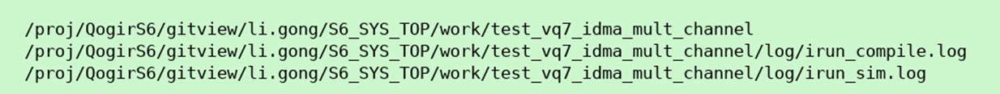
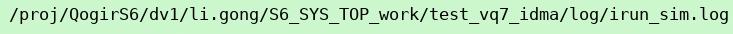
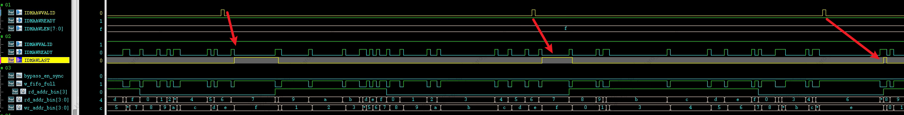
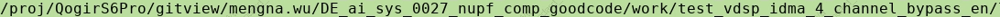

# sync_fifo分析

## S6-SOCV

> 1. case路径
>
>    1. case1
>
>    2. case2 
>
> 2. 波形截图——IDMA
>    1. 
>       1. 理想状态下，下一笔cmd会和上一笔的wlast同时拉高
>       1. 猜测时序：2nd wvalid在1st data发到e时
>
> 

## S6P

> *  

